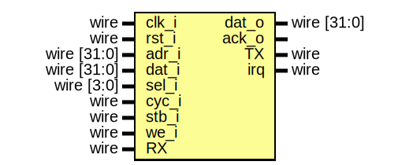

# ms_uart
A universal Asynchronous Receiver/Transmitter (UART) Soft IP with the following features:
- A fixed fram format (8N1)
- 16-byte TX and RX FIFOs with programmable thresholds
- 16-bit prescaler (PR) for programable baud rate generation
- Programmable baud rate, ```Baud_rate = CLK/((PR+1)*16)```
- Four Interrupt Sources:
    + RX Fifo is full
    + TX Fifo is empty
    + RX Fifo level is above the set threshold
    + TX Fifo level is below the set threshold

The IP comes with wrappers for both the Wishbone (classical) and APB buses.

## The Interface
### ms_tmr32


### ms_tmr32_wb


### ms_tmr32_apb


## I/O Registers
| Register | Offset | Mode         | Description |
| -------- | ------ | ------------ | ----------- |
| Data      | 0x000  | RW        | Read data from RX FIFO or write data tp TX FIFO   |
| Prescaler | 0x004  | RW        | ```Baud_rate = Bus_Clock_Freq/((Prescale+1)*16)```|
| TX FIFO Threshold| 0x008   | RW| TX FIFO Threshold for IRQ generation |
| RX FIFO Threshold| 0x00C   | RW| TX FIFO Threshold for IRQ generation |
| Control| 0x100 | RW | 0x100 | Bit 0: UART Enable, Bit 1: TX Enable, Bit 2: RX Enable |
| RIS | 0x200 | R | Raw Status Register |
| MIS | 0x204 | R | Masked Status Register |
| IM | 0x208 | RW | Interrupts Masking Register |
| ICR | 0x20C | W | Interrupts Clear Register |
