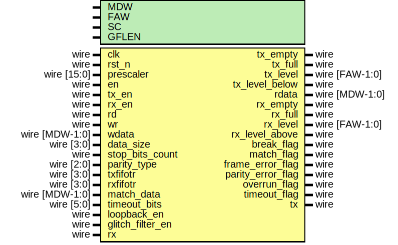

# EF_UART

UART, or universal asynchronous receiver-transmitter, is one of the most used device-to-device communication protocols. A UART enables two devices to exchange data serially without sharing the clock in a frame oriented way. The frame consists of a start bit, a number of data bits (typically one byte), a parity bit (optional) and 1-2 stop bits. 
EF_UART is a Soft IP with the following features:
- A configurable frame format
    - Data bits could vary from 5 to 9 bits
    - Even, odd, stick, or no-parity bit generation/detection
    - One or Two stop bit generation
- Line-break detection
- Configurable receiver timeout
- Loopback capability for testing/debugging
- Glitch Filter on RX enable
- Matching received data detection 
- 16-byte TX and RX FIFOs with programmable thresholds
- 16-bit prescaler (PR) for programable baud rate generation
- Ten Interrupt Sources:
    + RX FIFO is full
    + TX FIFO is empty
    + RX FIFO level is above the set threshold
    + TX FIFO level is below the set threshold
    + Line break detection
    + Receiver data match
    + Frame Error
    + Parity Error
    + Overrun
    + Receiver timeout 

## The Interface



### Module Parameters 

|Parameter|Description|Default Value|
|---|---|---|
|SC|Number of samples per bit/baud|8|
|MDW|Max data size/width|9|
|GFLEN|Length (number of stages) of the glitch filter|8|
|FAW|FIFO Address width; Depth=2^AW|4|

### Ports 

|Port|Direction|Width|Description|
|---|---|---|---|
|rx|input|1|RX connected to the external interface|
|tx|output|1|TX connected to external interface|
|prescaler|input|16|Prescaler used to determine the baud rate.|
|en|input|1|Enable for UART|
|tx_en|input|1|Enable for UART transmission|
|rx_en|input|1|Enable for UART receiving|
|wdata|input|MDW|Transmission data|
|timeout_bits|input|6|Receiver Timeout measured in number of bits.|
|loopback_en|input|1|Loopback enable; connect tx to the rx|
|glitch_filter_en|input|1|UART Glitch Filer on RX enable|
|tx_level|output|FAW|The current level of TX FIFO|
|rx_level|output|FAW|The current level of RX FIFO|
|rd|input|1|Read from RX FIFO signal|
|wr|input|1|Write to TX FIFO signal|
|data_size|input|4|Number of data bits in the frame|
|stop_bits_count|input|1|Number of stop bits in the frame (could be 1 or 2)|
|parity_type|input|3|Type of Parity in the frame|
|txfifotr|input|FAW|TX FIFO Threshold|
|rxfifotr|input|FAW|RX FIFO Threshold|
|match_data|input|MDW|Match data (match flag would be raised if it matches what is recieved)|
|tx_empty|output|1|TX empty flag|
|tx_full|output|1|TX full flag|
|tx_level_below|output|1|TX level below flag|
|rdata|output|MDW|Recieved Data|
|rx_empty|output|1|RX empty flag|
|rx_full|output|1|RX full flag|
|rx_level_above|output|1|RX level above flag|
|break_flag|output|1|Break flag|
|match_flag|output|1|Match flag|
|frame_error_flag|output|1|Frame error flag|
|parity_error_flag|output|1|Parity error flag|
|overrun_flag|output|1|Overrun flag|
|timeout_flag|output|1|Timeout flag|

## Implementation example 
The following table is the result for implmenting the IP using Sky130 PDK and the [OpenLane2](https://github.com/efabless/openlane2) flow tool. You can find the configuration file used [here]()
|Module | Number of cells | Max. freq |
|-|-|-|
|EF_UART|||
|EF_UART_APB||
|EF_UART_AHBL||
|EF_UART_WB||


## System Integration

```EF_UART``` comes with APB, AHB and WB bus wrappers in Verilog HDL; based on your use case, use one of these wrappers or create your own wrapper for your system bus type. 

The ```EF_UART``` ```tx``` and ```rx``` ports must be connected, both or one of them, to an input I/O pad for ```rx``` and an output I/O pad for ```tx```.

```verilog
EF_UART_APB UART0 (
		`TB_APB_SLAVE_CONN,
		.rx(rx),
		.tx(tx)
	);
```
Note: ``` `TB_APB_SLAVE_CONN ``` is a convenient macro provided by [IP_Utilities](https://github.com/shalan/IP_Utilities).

## I/O Registers

The I/O registers are provided by the bus wrapper. This section applies to all provided bus wrappers.

|Name|Offset|Reset Value|Access Mode[^1]|Description|
|---|---|---|---|---|
|RXDATA|0000|0x00000000|r|RX Data register; the interface to the Receive FIFO.|
|TXDATA|0004|0x00000000|w|TX Data register; ; the interface to the Receive FIFO.|
|PR|000c|0x00000000|w|The Prescaler register; used to determine the baud rate. $Baud\ rate = clock\ freq/((PR+1)\times16)$.|
|CTRL|0008|0x00000000|w|UART Control Register|
|CFG|0010|0x00003F08|w|UART Configuration Register|
|FIFOCTRL|0014|0x00000000|w|FIFO Control Register|
|FIFOS|0018|0x00000000|r|FIFO Status Register|
|MATCH|001c|0x00000000|w|Match Register|
|IM|0f00|0x00000000|w|Interrupt Mask Register; write 1/0 to enable/disable interrupts; check the interrupt flags table for more details|
|RIS|0f08|0x00000000|w|Raw Interrupt Status; reflects the current interrupts status;check the interrupt flags table for more details|
|MIS|0f04|0x00000000|w|Masked Interrupt Status; On a read, this register gives the current masked status value of the corresponding interrupt. A write has no effect; check the interrupt flags table for more details|
|IC|0f0c|0x00000000|w|Interrupt Clear Register; On a write of 1, the corresponding interrupt (both raw interrupt and masked interrupt, if enabled) is cleared; check the interrupt flags table for more details|

[^1]: r: read-only; w: write-only (reading returns the last written data); rw: read/write.

### RX Data register [Offset: 0x0, mode: r]

RX Data register; the interface to the Receive FIFO.


### TX Data register [Offset: 0x4, mode: w]

TX Data register; ; the interface to the Receive FIFO.


### The Prescaler register [Offset: 0xc, mode: w]

The Prescaler register; used to determine the baud rate. $baud\ rate = (Clock\ freq)/((PR+1)\times16)$.


### UART Control Register [Offset: 0x8, mode: w]

UART Control Register


|bit|field name|width|description|
|---|---|---|---|
|0|en|1|UART enable|
|1|txen|1|UART Transmitter enable|
|2|rxen|1|UART Receiver enable|
|3|lpen|1|Loopback (connect RX and TX pins together) enable|
|4|gfen|1|UART Glitch Filer on RX enable|


### UART Configuration Register [Offset: 0x10, mode: w]

UART Configuration Register


|bit|field name|width|description|
|---|---|---|---|
|0|wlen|4|Data word length: 5-9 bits|
|4|stp2|1|Two Stop Bits Select|
|5|parity|3|Parity Type: 000: None, 001: odd, 010: even, 100: Sticky 0, 101: Sticky 1|
|8|timeout|6|Receiver Timeout measured in number of bits|


### FIFO Control Register [Offset: 0x14, mode: w]

FIFO Control Register


|bit|field name|width|description|
|---|---|---|---|
|0|TXLT|4|Transmit FIFO Level Threshold|
|8|RXLT|4|Receive FIFO Level Threshold|


### FIFO Status Register [Offset: 0x18, mode: r]

FIFO Status Register


|bit|field name|width|description|
|---|---|---|---|
|0|RXL|4|Receive FIFO Level|
|8|TXL|4|Transmit FIFO Level|


### Match Register [Offset: 0x1c, mode: w]

Match Register


## Interrupt Flags


The following are the bit definitions for the interrupt registers: IM, RIS, MIS, and IC.

|Bit|Flag|Width|Description|
|---|---|---|---|
|0|TXE|1|Transmit FIFO is Empty.|
|1|RXF|1|Receive FIFO is Full.|
|2|TXB|1|Transmit FIFO level is Below Threshold.|
|3|RXA|1|Receive FIFO level is Above Threshold.|
|4|BRK|1|Line Break; 13 consecutive 0's have been detected on the line.|
|5|MATCH|1|Match; the receive data matches the MATCH register.|
|6|FE|1|Framing Error; the receiver does not see a "stop" bit at the expected "stop" bit time.|
|7|PRE|1|Parity Error; the receiver calculated parity does not match the received one.|
|8|OR|1|Overrun; data has been received but the RX FIFO is full.|
|9|RTO|1|Receiver Timeout; no data has been received for the time of a specified number of bits.|

## F/W Usage Guidelines:
1. Set the prescaler according to the required transmission and receiving baud rate where:  $Baud\ rate = Bus\ Clock\ Freq/((Prescaler+1)\times16)$. Setting the prescaler is done through writing to ``PR`` register
2. Configure the frame format by : 
    * Choosing the number of data bits which could vary from 5 to 9. This is done by setting the ```wlen``` field in the ```CFG``` register
    * Choosing whether the stop bits are one or two by setting the ```stb2``` bit in ```CFG``` register where ‘0’ means one bit and ‘1’ means two bits
    * Choosing the parity type by setting ```parity``` field in ```CFG``` register where 000: None, 001: odd, 010: even, 100: Sticky 0, 101: Sticky 1
3. Set the receiver timeout value which fires the ```RTO``` interrupt after a certain amount of bits are received. This would be useful when the message received is not a multiple of the FIFO’s width.Timeout can be set by writing to the ```timeout``` field in the ```CFG``` register
4. Set the FIFO thresholds  by writing to the ```RXLT``` and ```TXLT``` fields in ```FIFOCTRL``` register. This would fire ```RXA``` and ```TXB``` interrupts when the RX FIFO level is above the threshold and TX FIFO level is below the threshold.
5. Enable the UART as well as RX or TX or both by setting ```en``` , ```txen```, and ```rxen``` bits to ones in the ```CTRL``` register
6. To optionally connect the RX signal to the TX signal so the UART transmits whatever it receives then enable loopback by setting the ```loopback``` bit to one in the ```CTRL``` register.
7. To optionally enable glitch filter on RX , set the ```gfen``` bit to one in the ```CTRL``` register.
8. To read what was received , you can read ```RXDATA``` register. Note: you should check that there is something in the FIFO before reading using the interrupts registers.
9. To optionally check if the data received matches a certain value by writing to the ```MATCH``` register. This would fire the ```MATCH``` interrupt if the received data matches the match value.
10. To transmit, write to the ```TXDATA``` register. Note: you should check that the FIFO is not full before adding something to it using the interrupts register to avoid losing data. 

## Installation:
You can either clone repo or use [IPM](https://github.com/efabless/IPM) which is an open-source IPs Package Manager
* To clone repo
```git clone https://github.com/efabless/EF_UART.git```

* To download via IPM , follow installation guides [here](https://github.com/efabless/IPM/blob/main/README.md) then run 
```ipm install EF_UART```

## Simulation:

### Run Verilog Testbench:

1. Clone [IP_Utilities](https://github.com/shalan/IP_Utilities) repo under ``EF_UART/`` directory
2. In the directory ``EF_UART/verify/utb/`` run ``make APB-RTL``

### Run cocotb UVM Testbench:

TBD
