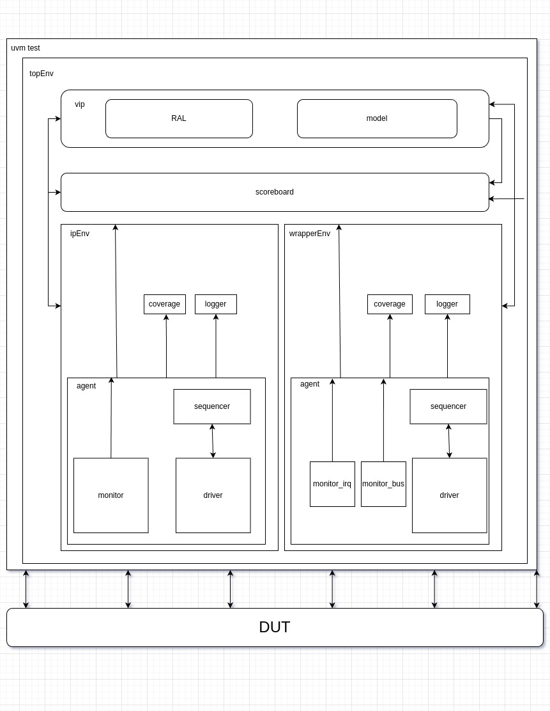

<p align="center">
  
</p>
<p align="center">
    <h1 align="center">EFABLESS-UVM-ENV</h1>
</p>
<p align="center">
    <em>Power up your designs with efabless-uvm-env</em>
</p>
<p align="center">
	<!-- local repository, no metadata badges. -->
<p>
<p align="center">
		<em>Developed with the software and tools below.</em>
</p>
<p align="center">
	
</p>
<hr>

##  Quick Links

> - [ Overview](#-overview)
> - [ Features](#-features)
> - [ Repository Structure](#-repository-structure)
> - [ Modules](#-modules)
> - [ Getting Started](#-getting-started)
> - [ Project Roadmap](#-project-roadmap)
> - [ Contributing](#-contributing)
> - [ License](#-license)

---

##  Overview

The efabless-uvm-env is a project aimed at providing a comprehensive and reusable environment for Universal Verification Methodology (UVM) based verification flows. The environment should be suatable for any IP(Intellectual Property) with a wrapper generated by efabless wrapper generator. It offers a collection of modules, libraries, and utilities that facilitate the development and execution of UVM-based testbenches. By leveraging this codebase, engineers can streamline the verification process, improve code reuse, and enhance productivity. The efabless-uvm-env project embodies the value proposition of enabling efficient and standardized UVM-based verification, ultimately leading to reliable and robust hardware designs.


---

##  Features

|    |   Feature         | Description |
|----|-------------------|---------------------------------------------------------------|
| ⚙️  | **Architecture**  | The project follows a modular architecture with separate modules for different functionalities. It uses Python for implementation. |
| 🔩 | **Code Quality**  | The codebase has good code quality and follows a consistent coding style. The Makefile is used for building and managing the project. |
| 📄 | **Documentation** | The project has documentation in the form of comments in the code and a README file. The documentation provides information about the project and its usage. |
| 🔌 | **Integrations**  | The project has external dependencies such as uvm-python and cocotb libraires. It also uses Makefile for build automation. |
| 🧩 | **Modularity**    | The codebase is highly modular, allowing for code reusability and easy maintenance. Each functionality is implemented in a separate module. |

---

##  Repository Structure

```sh
└── efabless-uvm-env/
    ├── Makefile
    ├── ip_env
    │   ├── ip_agent
    │   │   ├── ip_agent.py
    │   │   ├── ip_driver.py
    │   │   ├── ip_monitor.py
    │   │   └── ip_sequencer.py
    │   ├── ip_coverage
    │   │   └── ip_coverage.py
    │   ├── ip_env.py
    │   ├── ip_item.py
    │   ├── ip_logger
    │   │   └── ip_logger.py
    │   └── ip_seq_lib
    │       └── uart_rx_seq.py
    ├── ip_files
    │   ├── ip_if.py
    │   └── wrapper_if.py
    ├── scoreboard.py
    ├── test_lib.py
    ├── top.v
    ├── top_env.py
    ├── vip
    │   ├── model.py
    │   └── vip.py
    └── wrapper_env
        ├── wrapper_agent
        │   ├── wrapper_agent.py
        │   ├── wrapper_bus_monitor.py
        │   ├── wrapper_driver.py
        │   ├── wrapper_irq_monitor.py
        │   └── wrapper_sequencer.py
        ├── wrapper_coverage
        │   ├── coverage_regs.py
        │   └── wrapper_coverage.py
        ├── wrapper_env.py
        ├── wrapper_item.py
        ├── wrapper_logger
        │   └── wrapper_logger.py
        ├── wrapper_regs.py
        └── wrapper_seq_lib
            ├── uart_config.py
            ├── uart_rx_read.py
            ├── uart_tx_seq.py
            └── write_read_regs.py
```

---

##  Modules

<details closed><summary>.</summary>

| File                             | Summary                                                                                                                                                                                                                                                                                                                                                                                                                |
| ---                              | ---                                                                                                                                                                                                                                                                                                                                                                                                                    |
| [.gitignore](.gitignore)         | This code snippet represents the file `.gitignore` in the repository. It specifies the files and directories to be ignored by version control, such as YAML files, HTML files, compiled Python files, and various build artifacts.                                                                                                                                                                                     |
| [test_lib.py](test_lib.py)       | The test_lib.py code is the toppest level component of the efabless-uvm-env repository. It defines the test class, which initializes the top environment,executes test sequences and provide interfaces and data to the top environment.|
| [scoreboard.py](scoreboard.py)   | The `scoreboard.py` code snippet is a part of the `efabless-uvm-env` repository. It defines a `scoreboard` class that serves as a scoreboard component in the Universal Verification Methodology (UVM) architecture. The scoreboard receives data from VIP and RTL and performs comparisons to check for mismatches.                                                                                        |
| [top_env.py](top_env.py)         | The `top_env.py` file in the `efabless-uvm-env` repository is the top-level verification environment for any Intellectual Property (IP) encapsulated by a bus. It connects the wrapperEnv (verification environment for the bus), ipEnv (verification environment specific to the IP), VIP (Verification IP), and Scoreboard components. It initializes and connects these components to ensure correct functionality. |
| [Makefile](Makefile)             | This code snippet consists of a Makefile that is responsible for building and running the simulation of the efabless-uvm-env repository. The Makefile includes the necessary verilog sources and invokes the cocotb-config tool to generate the simulation makefiles. It allows for efficient simulation of the test environment defined in the repository.                                                            |
| [top.v](top.v)                   | This code snippet is a module called top where the dut is initialized.                                                                                                                                                                                                                          |

</details>

<details closed><summary>ip_env</summary>

| File                            | Summary                                                                                                                                                                                                                                                                 |
| ---                             | ---                                                                                                                                                                                                                                                                     |
| [ip_item.py](ip_env/ip_item.py) | This code snippet defines the `ip_item` class which is a UVM sequence item. It represents an item to be sent or received over a UART interface. It has properties for character value and direction, and methods for converting to a string and performing comparisons. |
| [ip_env.py](ip_env/ip_env.py)   | The `ip_env.py` code snippet is part of the `efabless-uvm-env` repository. It defines the `ip_env` class, which is an environment for verifying Intellectual Property (IP). It includes an agent, coverage model, and logger model to analyze and log IP behavior.      |

</details>

<details closed><summary>ip_env.ip_coverage</summary>

| File                                                | Summary                                                                                                                                                                                                                                 |
| ---                                                 | ---                                                                                                                                                                                                                                     |
| [ip_coverage.py](ip_env/ip_coverage/ip_coverage.py) | The `ip_coverage.py` file in the `ip_env` directory is a component that initializes coverage groups and controls when to sample data. It extends the `UVMComponent` class and contains methods for initializing coverage groups and controlling when the data is sampled. |

</details>

<details closed><summary>ip_env.ip_seq_lib</summary>

| File                                               | Summary                                                                                                                                                                                                                                                      |
| ---                                                | ---                                                                                                                                                                                                                                                          |
| [<>.py](ip_env/ip_seq_lib/) | This folder contains files that inhert from the `UVMSequence` class. the sequence for running through ip_driver the tests should be implemented in the body function. |

</details>

<details closed><summary>ip_env.ip_logger</summary>

| File                                          | Summary                                                                                                                                                                                                                                                                                                                                                                                                                 |
| ---                                           | ---                                                                                                                                                                                                                                                                                                                                                                                                                     |
| [ip_logger.py](ip_env/ip_logger/ip_logger.py) | The `ip_logger.py` code snippet is a component in the `ip_env` directory of the repository. It is responsible for logging bus transactions and writing them to a logger file. The logger file is created in the `loggers` directory, and each transaction is logged with the timestamp, and important data from the transaction. The logged data is formatted into a table with column widths calculated dynamically. |

</details>

<details closed><summary>ip_env.ip_agent</summary>

| File                                               | Summary                                                                                                                                                                                                                                                                                                                                                                                                                                                                                        |
| ---                                                | ---                                                                                                                                                                                                                                                                                                                                                                                                                                                                                            |
| [ip_sequencer.py](ip_env/ip_agent/ip_sequencer.py) | This code snippet defines an IP sequencer component for the ip_agent in the efabless-uvm-env repository. It extends the UVMSequencer class and initializes it with a name. In most cases nothing more should be added                                                                                                                                                                                                                                                                                                                 |
| [ip_driver.py](ip_env/ip_agent/ip_driver.py)       | The `ip_driver.py` code snippet is part of the `ip_env` module in the `efabless-uvm-env` repository. It is responsible for driving transactions into the IP, handling input signals, and implementing timing controls.                                                                                                                                                                                                                                                                          |
| [ip_agent.py](ip_env/ip_agent/ip_agent.py)         | The `ip_agent.py` code snippet is a crucial component within the `efabless-uvm-env` repository's architecture. It is responsible for the verification of Intellectual Property (IP) and consists of three sub-components: driver, monitor, and sequencer. The driver drives test scenarios and stimuli to the IP, the monitor observes and validates the IP's behavior and adherence to protocol specifications, and the sequencer manages the sequence of operations and tests. |
| [ip_monitor.py](ip_env/ip_agent/ip_monitor.py)     | The `ip_monitor.py` code snippet is a UVM monitor component that captures and analyzes transactions in an IP interface. It uses a UVM analysis port to transmit the captured transactions and includes methods to sample both TX and RX transactions. The monitor component also retrieves configuration data and performs timing calculations.                                                                                                                                                |

</details>

<details closed><summary>vip</summary>

| File                     | Summary                                                                                                                                                                                                                                                                                                                                                                                                                      |
| ---                      | ---                                                                                                                                                                                                                                                                                                                                                                                                                          |
| [vip.py](vip/vip.py)     | The code snippet represents the VIP (Verification IP) component within the efabless-uvm-env repository. Its main role is to validate the IP and bus functionality and performance. It emulates the behavior of the IP and bus, generates expected outputs, interfaces with the scoreboard for verification, and integrates with the Register Abstraction Layer (RAL) for comprehensive register testing and error detection. |

</details>

<details closed><summary>wrapper_env</summary>

| File                                           | Summary                                                                                                                                                                                                                                                                                                                                                                                                                                                                       |
| ---                                            | ---                                                                                                                                                                                                                                                                                                                                                                                                                                                                           |
| [wrapper_regs.py](wrapper_env/wrapper_regs.py) | This code snippet, located in `wrapper_env/wrapper_regs.py`, initializes and manages a set of registers specified in a JSON or YAML file. It provides functionality to write and read register values and replaces parameter values in the data. The code also handles the existence of interrupt registers.                                                                                                                                                                  |
| [wrapper_env.py](wrapper_env/wrapper_env.py)   | The `wrapper_env` code snippet is part of the `efabless-uvm-env` repository's architecture. It is a specialized environment used to verify the bus system in an IP design. Its main components are the agent (driver and monitor), coverage model, and logger model. The code builds and connects these components to ensure comprehensive testing and validation of the bus interface.                                                                                       |
| [wrapper_item.py](wrapper_env/wrapper_item.py) | The wrapper_item.py code snippet in the wrapper_env module defines two UVM sequence items: wrapper_bus_item and wrapper_irq_item. The wrapper_bus_item represents a bus transaction with attributes for address, data, and transaction type (read/write). The wrapper_irq_item represents an interrupt with a single attribute for the interrupt trigger. These items are used to model bus transactions and interrupts in the wrapper environment component of the codebase. |

</details>

<details closed><summary>wrapper_env.wrapper_coverage</summary>

| File                                                                    | Summary                                                                                                                                                                                                                                                                                                                        |
| ---                                                                     | ---                                                                                                                                                                                                                                                                                                                            |
| [coverage_regs.py](wrapper_env/wrapper_coverage/coverage_regs.py)       | This code snippet, located at `wrapper_env/wrapper_coverage/coverage_regs.py`, contains the `wrapper_cov_groups` class. It is responsible for handling coverage sampling and applying decorators to the coverage points. The class initializes coverage for bus and IRQ, and defines coverage points for registers and fields. |
| [wrapper_coverage.py](wrapper_env/wrapper_coverage/wrapper_coverage.py) | The code snippet is a component in the parent repository that initializes coverage groups and controls when to sample data for the bus and IRQ. It provides methods to write bus and IRQ coverage. It relies on a JSON file for wrapper regs.                                                                                  |

</details>

<details closed><summary>wrapper_env.wrapper_agent</summary>

| File                                                                       | Summary                                                                                                                                                                                                                                                                                                                                                                                               |
| ---                                                                        | ---                                                                                                                                                                                                                                                                                                                                                                                                   |
| [wrapper_irq_monitor.py](wrapper_env/wrapper_agent/wrapper_irq_monitor.py) | The `wrapper_irq_monitor.py` code snippet is a UVM monitor component that captures interrupt signals. It builds a phase, checks for the interface, and asynchronously samples the interrupt signal. It creates a transaction and writes it to the analysis port, providing information about the sampled IRQ transaction.                                                                             |
| [wrapper_driver.py](wrapper_env/wrapper_agent/wrapper_driver.py)           | The `wrapper_driver.py` code snippet is a component within the `wrapper_agent` module of the `efabless-uvm-env` repository. It defines the driver responsible for driving transactions into the DUT (Design Under Test). The driver handles read and write operations using an APB (Advanced Peripheral Bus) interface.                                                                               |
| [wrapper_agent.py](wrapper_env/wrapper_agent/wrapper_agent.py)             | The `wrapper_agent.py` code snippet is a crucial component of the `wrapperEnv` in the `efabless-uvm-env` repository. It verifies the bus system in an IP design, ensuring adherence to protocol standards such as Wishbone, AHB, or APB. It includes a driver, monitor, and sequencer for generating bus transaction scenarios, verifying compliance, and coordinating test operations, respectively. |
| [wrapper_sequencer.py](wrapper_env/wrapper_agent/wrapper_sequencer.py)     | The code snippet defines a sequencer class in the wrapper_agent module. It inherits from UVMSequencer and provides a constructor. This class is a crucial component in managing the sequencing of transactions in the wrapper environment of the efabless-uvm-env repository.                                                                                                                         |
| [wrapper_bus_monitor.py](wrapper_env/wrapper_agent/wrapper_bus_monitor.py) | This code snippet represents the wrapper bus monitor component in the efabless-uvm-env repository. It is responsible for monitoring transactions on the bus and sending them to the analysis port. It also updates register values based on the transaction and provides logging information.                                                                                                         |

</details>

<details closed><summary>wrapper_env.wrapper_seq_lib</summary>

| File                                                                 | Summary                                                                                                                                                                                                                                                                                                                                                                  |
| ---                                                                  | ---                                                                                                                                                                                                                                                                                                                                                                      |
| [<>.py](ip_env/ip_seq_lib/) | This folder contains files that inhert from the `UVMSequence` class. the sequence for running through ip_driver the tests should be implemented in the body function. |                                                                                                  |

</details>

<details closed><summary>wrapper_env.wrapper_logger</summary>

| File                                                              | Summary                                                                                                                                                                                                                                                  |
| ---                                                               | ---                                                                                                                                                                                                                                                      |
| [wrapper_logger.py](wrapper_env/wrapper_logger/wrapper_logger.py) | The code in the `wrapper_logger.py` file is a component that logs bus and IRQ activities in the wrapper environment. It analyzes transactions and writes them to a log file in a tabular format. The log file is created during the configuration phase. |

</details>

<details closed><summary>ip_files</summary>

| File                                    | Summary                                                                                                                                                                                                                                                                                                      |
| ---                                     | ---                                                                                                                                                                                                                                                                                                          |
| [ip_if.py](ip_files/ip_if.py)           | The code snippet in `ip_files/ip_if.py` defines an interface class `ip_if` that inherits from `sv_if`. It initializes a bus map and passes it to the parent class. The interface class represents the actual signals of an IP module in the `efabless-uvm-env` repository's architecture, such as RX and TX. |
| [wrapper_if.py](ip_files/wrapper_if.py) | This code snippet, located in the wrapper_if.py file, defines interface classes for the wrapper bus and IRQ signals. These classes map the signals to their corresponding names.                                                                                                                             |

</details>

---

##  Getting Started

***note***

As this project is in development, a lot of changes should be made to verify new ip but it's planned to make most of class as generic as possible.

***files to modify***

Copy the all files from and update the following files:
- Makefile
    - Modify the relative paths to the verilog files
- ip_if.py
    - Modify the bus map with new ip signals
- ip_driver.py and ip_montor.py 
    - Modify the reading and writing to the signals
- vip.py
    - Update the model with the new ip specifications
- ip_coverage.py
    - Add coverage groups for the new IP
- ip_logger.py
    - Update logging columns names and data types
- Add new sequences
- test_lib
    - Add tests that uses the new sequences

---
##  Project Roadmap

***TODO***

---

##  Contributing

***TODO***

<details closed>
    <summary>Contributing Guidelines</summary>

1. **TODO**
</details>

---

##  License

**TODO**

---
